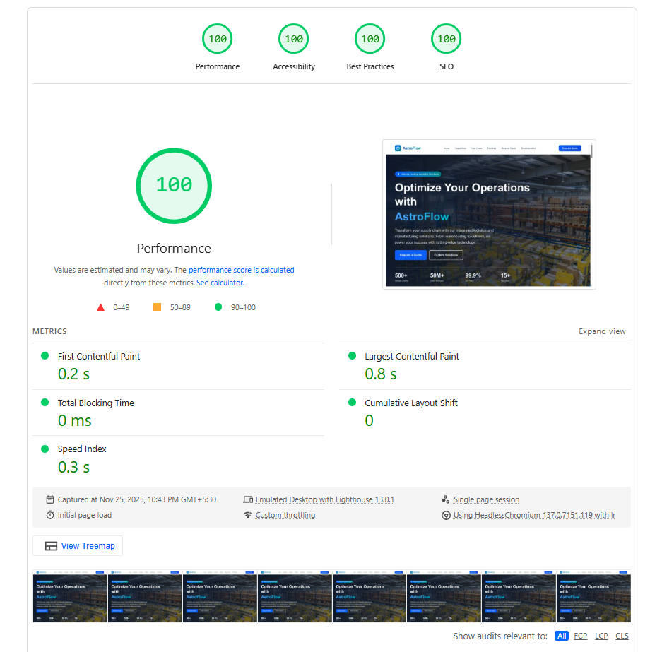

# LaravelSeo - Laravel SEO & Lighthouse Monitoring

Take control of your site’s search visibility with a fully automated optimisation suite built specifically for Laravel.


## 🖼️ Preview

### Website Screenshot


### Performance & Speed


## ✨ Features

- 🚀 **Real-Time Lighthouse** - Track SEO, accessibility, performance instantly
- 🔍 **Automatic Meta Tags** - Titles, descriptions, keywords generated dynamically
- 🖼️ **OpenGraph & Social** - Social preview automation
- 📊 **JSON-LD Schema** - Structured data generation
- 🛣️ **Route-Level Config** - Bespoke SEO settings for each route
- 🔌 **Seamless Integration** - Works with any Laravel project

## 📦 Pages Included

- **Home** - Hero, features, how it works
- **Capabilities** - Detailed feature breakdown
- **Use Cases** - SaaS, Agencies, eCommerce etc.
- **Facilities** - Features like Dashboard, API, etc.
- **Request Quote** - Contact for enterprise
- **Documentation** - Integration guides

## 🚀 Quick Start

### Prerequisites

- Node.js 18+ and npm

### Installation

1. Clone this repository:
```bash
git clone https://github.com/yourusername/laravelseo.git
cd laravelseo
```

2. Install dependencies:
```bash
npm install
```

3. Start the development server:
```bash
npm run dev
```

4. Open [http://localhost:4321](http://localhost:4321) in your browser

## 📝 Configuration

### Site Configuration

Update `src/config/site.ts` with your information.

## 📄 License

This project is licensed under the MIT License - see the [LICENSE](LICENSE) file for details.
